# React-Practical-8

# practical-8

- This repository shows the steps to deploy an app on the cloud using S3 and Cloudfront.
- AWS S3 (Simple Storage Service) is a highly scalable object storage service provided by Amazon Web Services that allows you to store and retrieve any amount of data from anywhere on the web.
- Amazon CloudFront is a content delivery network (CDN) service provided by Amazon Web Services (AWS) which is designed to deliver content, such as web pages, images, videos, and other static and dynamic files, with low latency and high transfer speeds.

---

## Source Code and Live Demonstration

- Source code for this app : [User-List-App](https://github.com/RiteshAdwani/User-List-React-App)
- Live Demonstration : [Site Preview](https://d4snby1cx1hyr.cloudfront.net/)

## Pre-requisites

- An AWS account with appropriate permissions to create and manage S3 buckets.

---

## Deployment Process

**Step 1: Build your React app**

- Run the command `npm run build` in your React app's root directory to create a production-ready build of your app.
- This will generate optimized static files in a `build` folder.

**Step 2: Create an S3 bucket**

- Go to the AWS Management Console and navigate to the S3 service.
- Create a new bucket by clicking on the "Create bucket" button.
- Choose a unique name for your bucket and select the region where you want to create it.
- Here I have created a bucket with the name 'ritesh-bucket-demo-s3`.
- On successful creation of bucket, we can the see it as below:

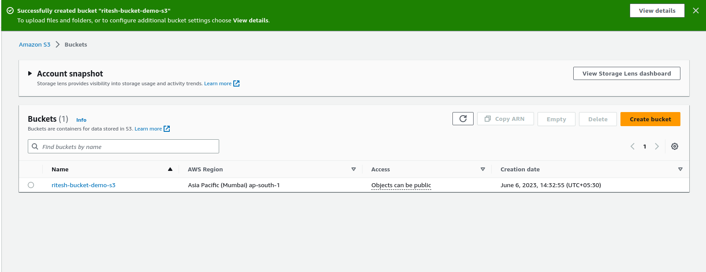

**Step 3: Upload your app files**

- In the S3 bucket, click on the "Upload" button and select all the files from your React app's `build` folder.
- Ensure that you include the index.html file and other necessary assets.
- Upload the files to your bucket.\
  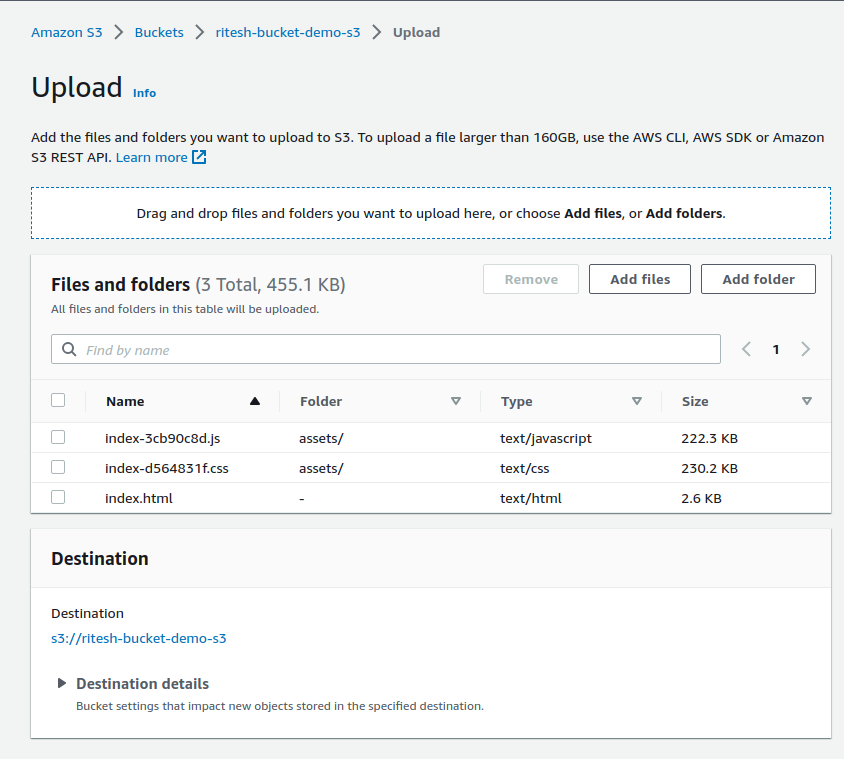

- On uploading the files, we can see it as below:\
  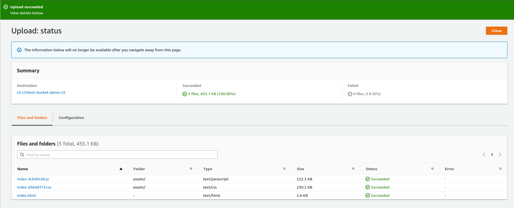

**Step 4: Set bucket permissions**

- Go to `Permissions` and edit `Block public access`.
- Here we have to uncheck the "Block all public access" entity to grant public read access to the files so that they can be accessed by users.\
  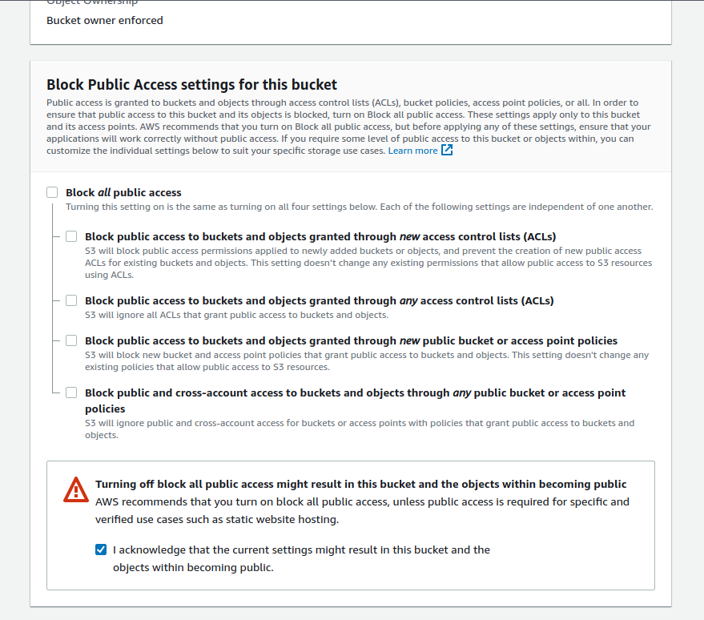

**Step 5: Create CloudFront Distribution**

- Search for Cloudfront and click on `create distribution`.
- Choose origin domain and bucket name for the distribution.\
  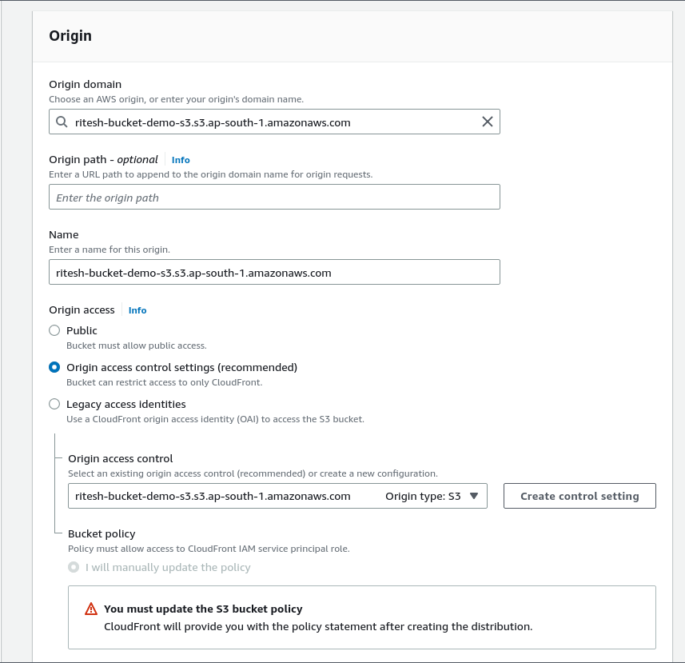

- In the `viewer` section, choose `Redirect HTTP to HTTPS`\
  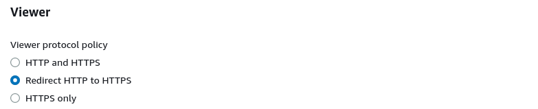

- In the `Web application firewall`, choose `Do not enable security protection`\
  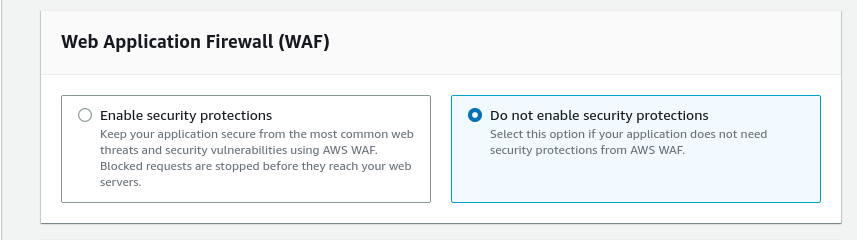

- Finally generate the distribution and copy the policy.\
  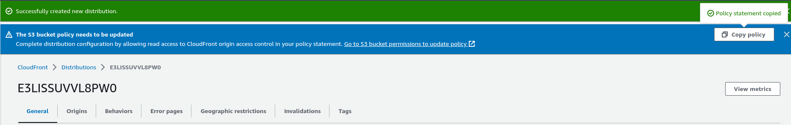

**Step 6: Setup custom error responses**

- Custom error responses in CloudFront are a feature that allows you to customize the error handling and provide a better user experience when errors occur.
- By default, CloudFront provides generic error pages for various HTTP error codes.
- However, with custom error responses, you can replace these default error pages with your own custom error pages or responses.
- Go to the distribution you created and navigate to the `Error Pages` section.
- Create custom error responses by selecting the error code and the response page path.\
  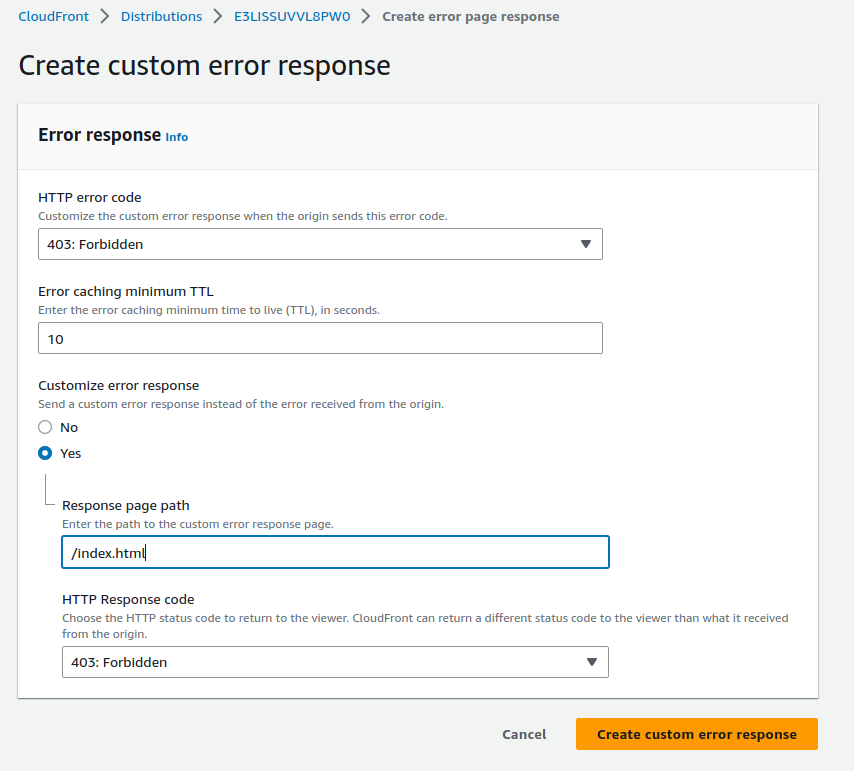
- Here I have added the following custom error responses:\
  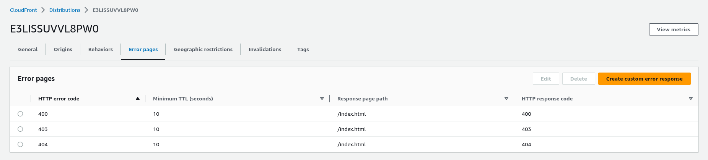

**Step 7: Edit Bucket Policy**

- Go to S3 bucket policy in `Permission` and click on `edit`.
- Paste the policy that you copied from the distribution.\
  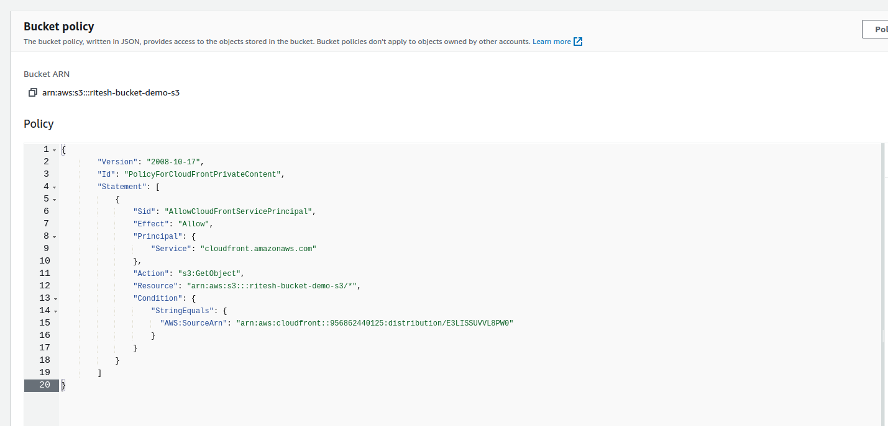

**Step 8: Access your deployed app**

- After performing the above steps, once the app is deployed, go to the `general` section in the cloudfront distribution.
- Here you will find the link under `Distribution domain name`.
- Copy this link, paste it in any browser and you will be able to access the deployed application hosted with AWS services.\
  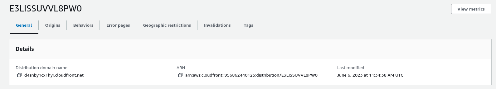
